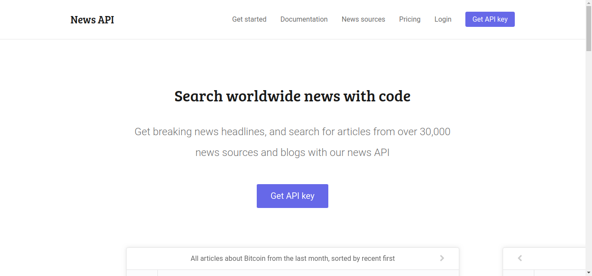
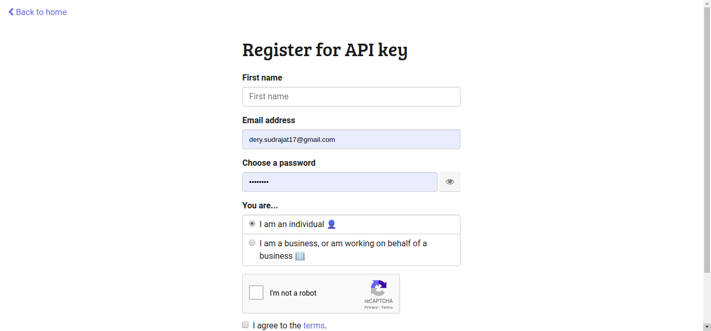
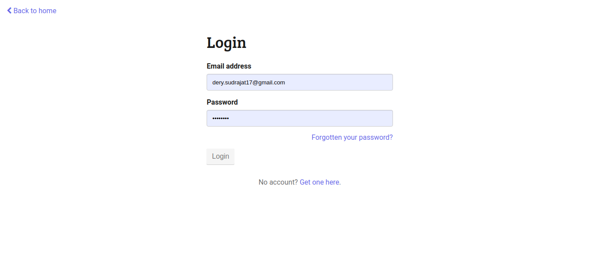
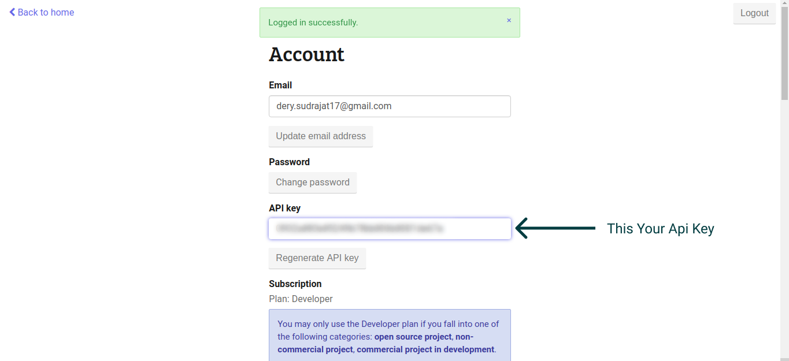
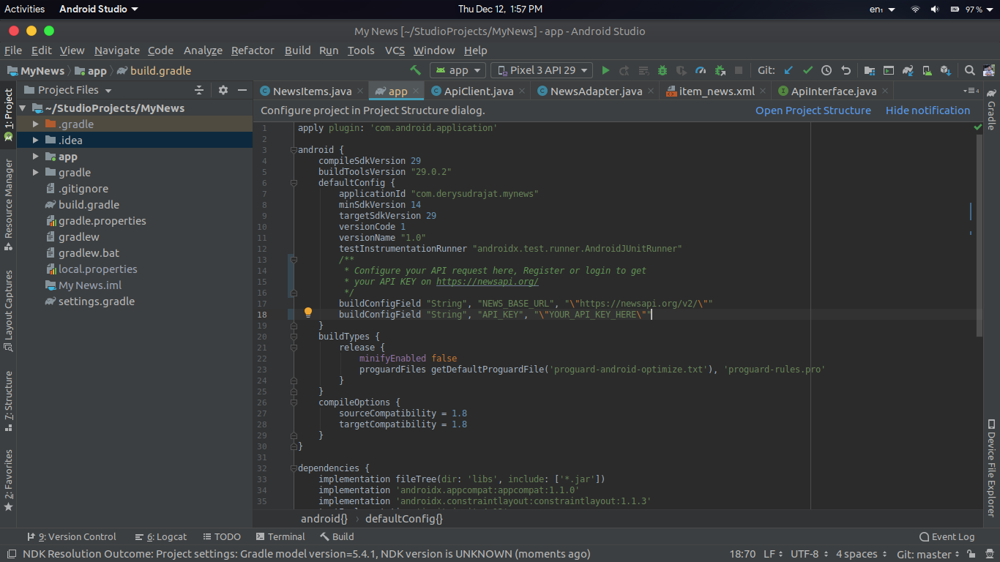

# My-News
Example of News App Using Android Jetpack Retrofit

## Getting Started
before using this project repository you must be get your API_KEY from [NEWSAPI](https://newsapi.org/).

1. Open the [NewsAPi.org](https://newsapi.org/).



2. Click `Get API Key` on home page.
3. You will require to register first, fill your data to create account



4. After you create account please login to get your API



5. After you login you will see `API Key` section below Button `Change Password`.



6. Copy this API Key
7. Go to the project Gradle Scripts > build.gradle (Module:app)



8. On The Section you will see `buildConfigField "String", "API_KEY", "\"YOUR_API_KEY_HERE\""`
9. Change string `YOUR_API_KEY_HERE` with your API_KEY that you get it before.
10. Sync the project, and Enjoy

```groovy
android {
    //...//
    
        /**
         * Configure your API request here, Register or login to get
         * your API KEY on https://newsapi.org/
         */
        buildConfigField "String", "NEWS_BASE_URL", "\"https://newsapi.org/v2/\""
        buildConfigField "String", "API_KEY", "\"YOUR_API_KEY_HERE\""
    }
```